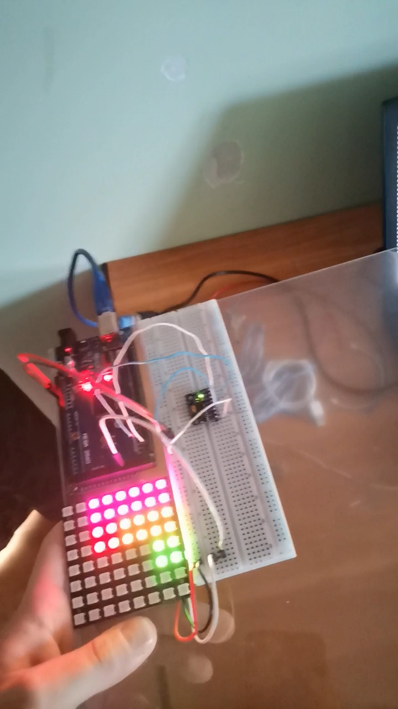

# 2048 Game Implementation

This project is a simple implementation of the 2048 game using C++ for microcontrollers. It leverages a few libraries to manage the game logic, display handling, and sensor input.

## Table of Contents

- [Configuration](#configuration)
  - [2048.h](#2048h)
  - [FastLED.h](#fastledh)
  - [basicMPU6050.h](#basicmpu6050h)
  - [Setup](#setup)
- [Logic](#logic)
  - [Display](#display)
  - [Input](#input)
  - [Loop](#loop)

## Configuration

### 2048.h

The main game logic resides in the `2048.h` file, which is a single-header library. Before using this library, define the `_2048_IMPLEMENTATION` macro to include the implementations of the game functions. A game table is declared to store the game state. The directions enumeration type is extended to include a **flat** position, renamed to `Orientation`.

### FastLED.h

This project utilizes the `FastLED.h` library to manage communication with the LED display. The following configurations are set:
- `LED_PIN`: Configured to pin `32` (modifiable).
- `LED_BRIGHTNESS`: Set between `0-255`. An arbitrary value of `16` is chosen for initial brightness but can be adjusted.
- `LED_COUNT`: Set to `64`, corresponding to the number of LEDs on the display.

A `leds` array is defined to hold the LED colors, matching the length of `LED_COUNT`.

### basicMPU6050.h

The `basicMPU6050.h` library facilitates communication with the MPU6050 sensor. An instance named `mpu` is created for managing interactions with this sensor.

### Setup

In the `setup` function:
- The random number generator (RNG) is initialized, and the 2048 game table is populated with two tiles.
- The display and gyroscope are configured.

## Logic

### Display

The `display()` function processes each row and column of the game table, invoking the `draw_cell()` function for each cell. Once all cells are processed, the `FastLED.show()` function is called to refresh the display. The `draw_cell()` function colors each cell based on its value. A helper function, `cell_color`, returns a color based on the input number, using a customizable formula.

### Input

The `getOrientation()` function retrieves inclination data from the accelerometer, utilizing `mpu.ax()`, `mpu.ay()`, and `mpu.az()`. These values are compared against a configurable `THRESHOLD`. Two helper methods, `sup()` and `sub()`, verify if values fall within the defined threshold.

### Loop

The `loop()` function first displays the current state of the game table. Next, it checks the current orientation against the previous one. If a change is detected, the function determines the current orientation using a `switch` statement and calls the corresponding function from `2048.h`. Finally, it updates the `prev_orientation` variable.

## Acknowledgments

This project may leverage various libraries, so please ensure to review their documentation for additional details. Contributions, feedback, and pull requests are always welcome to improve this implementation.

---

Feel free to clone the repository and experiment with the code to make it your own!
